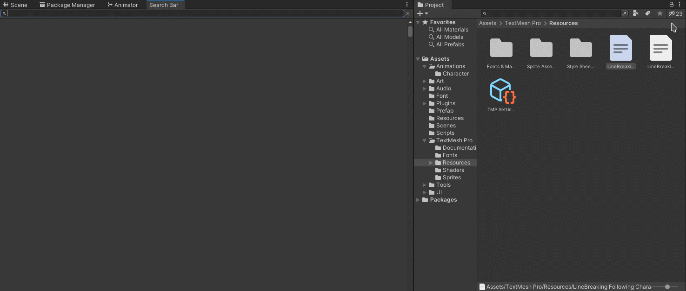

# Unity-Simple-Search-Bar

This is a sinple search bar that finds files in your project folder. When clicking on the link it will select and highlight the file in your project window. It works on IMGUI in Unity.

## Compatiblity

 - Tested in Unity Version 2020 or higher.

## Installation.
 ### Method 1
1. Download the package.
2. Import in your Project.
3. GO TO - Windows -> SearchBar. or Press Alt+Shift+F.
 ### Method 2
1. Clone the project
2. Add the Folder Searchbar in your project. 
3. GO TO - Windows -> SearchBar. or Press Alt+Shift+F.
   
## Screenshot

